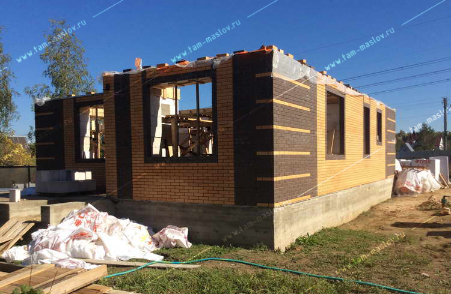
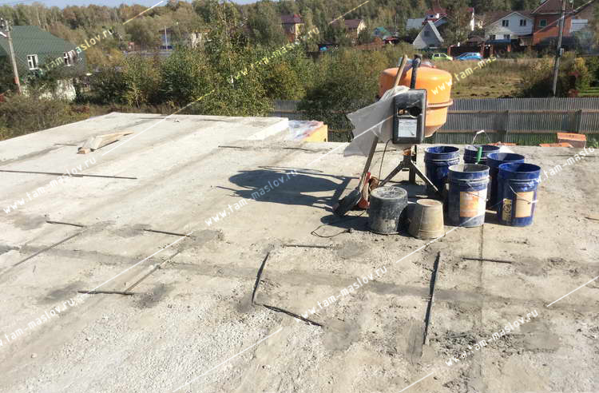

## Репортаж

### Реализованный проект

### Устройство ростверка по буронабивных сваях в грунте

### Установка опалубки и поднятие монолитного цоколя до отметки ноль

### Бетононасос заливает перекрытие первого этажа

### Начали выкладывать стены

### Устройство перемычек над дверными и оконными проёмами

### Дооделали первый этаж

