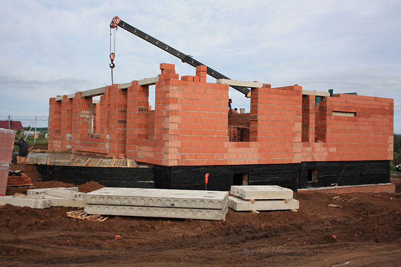

## Строительство

Лгут все.

В сфере строительства сложилась крайне сложная ситуация. Сложна она тем, что за весь период моего наблюдения, на всех объектах заказчик всегда был обманут в той или иной степени. Основной способ отъём денег – это завышение объёмов работ и раСтаниславкивание материалов на свои нужды. Занимаются этим все, от частных застройщиков до компаний позиционирующих себя как очень честных.

Добиться же качества на строительной площадке можно только одним способом — постоянно следить за ходом работ. Проработав в компании, занимающейся частным домостроением и позиционирующая себя высокопрофессиональной, я понял, что нет разницы в качестве работ между кустарными бригадами и такими компаниями. Эти же компании используют те же кустарные бригады. Разница только в цене.

Полная прозрачность — мой приоритет. Я работаю только по полной проектной документации и настоящей сметной документации. Добиваюсь максимальной открытости. Работаю над своей репутацией и предпочитаю зарабатывать себе имя. В группе единомышленников чётко контролирую весь цикл строительства, документируя каждый процесс и отчитываясь перед заказчиком.
